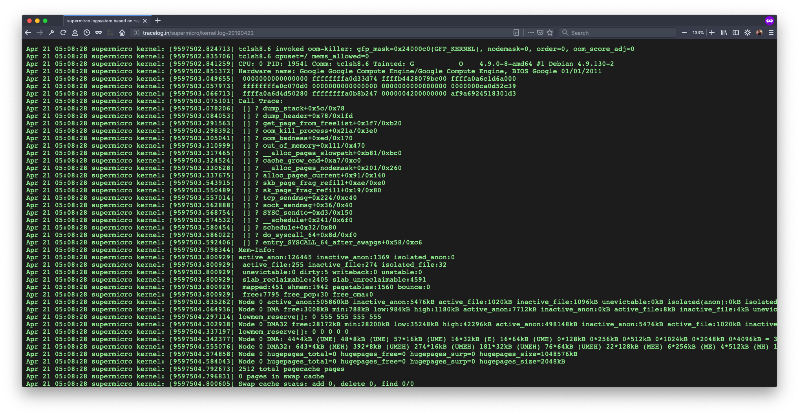

<center> <h2>supermicro logsystem</h2> </center>



Supermirco logsystem is based on `rsyslog` that can adapt for any linux log files (system logs, application logs, ...)
- Using minimal cpu, mem, io resources
- Realtime update with easy debugging/performing because of plaintext
- Core logic is based on `rsyslog` client-server architecture, using `syslog` standard for message logging
- Prevent dropping logs from client during `rsyslog` server outage
- Separating each client (via hostname) and each service (via systemd unit)
- Basic visualize via `nginx` static file serving, auto reload for fetching new logs on UI for every 30sec
- Can integrate with bigger logging system (ELK, ...)

Tree view of plaintext logs on `rsyslog-server`
```
root@logsystem:~# tree /var/log/logsystem/
/var/log/logsystem/
├── llnx
│   ├── agent.log
│   ├── agent.log-20190622
│   ├── agent.log-20190623
...
│   └── trace-agent.log-20190628
└── supermicro
    ├── chage.log
    ├── chage.log-20190422
    ├── CRON.log
    ├── CRON.log-20190622
...
    ├── usermod.log
    └── usermod.log-20190421

2 directories, 168 files
```

## Information

- Author: Hieu Huynh
- Implemented on Feb 24, 2019
- MIT License
